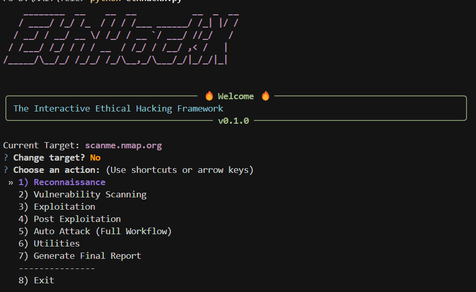

# EthHackX - Interactive Ethical Hacking Framework



EthHackX is a Python-based framework designed to streamline common tasks in ethical hacking and penetration testing workflows. It provides an interactive command-line interface (CLI) to guide users through reconnaissance, scanning, basic exploitation, and reporting.

## ⚠️ Ethical Use Disclaimer

**This tool is intended for educational and authorized security testing purposes ONLY.** Using EthHackX against systems or networks without explicit permission from the owner is illegal and unethical. The author (AnonAmit) is not responsible for any misuse or damage caused by this tool. Always ensure you have proper authorization before performing any security testing.

## 🚀 Installation

1.  **Clone the repository:**
    ```bash
    git clone https://github.com/AnonAmit/EthHackX.git 
    cd EthHackX
    ```

2.  **Create a virtual environment (recommended):**
    ```bash
    python -m venv venv
    source venv/bin/activate  # On Windows use `venv\Scripts\activate`
    ```

3.  **Install Python dependencies:**
    ```bash
    pip install -r requirements.txt
    ```

4.  **Install Required External Tools:**
    EthHackX relies on several external command-line tools. You **MUST** install these tools and ensure they are available in your system's PATH for the corresponding modules to function correctly.

    *   **Reconnaissance:**
        *   `nmap`: Network scanning (Required for Active Recon)
        *   `subfinder`: Subdomain enumeration (Required for Passive Recon)
        *   `whois`: WHOIS lookups (Optional, can use Python library as fallback)
        *   `dig` / `nslookup`: DNS lookups (Usually pre-installed)
    *   **Scanning:**
        *   `nikto`: Web server scanner
        *   `nuclei`: Vulnerability scanner
        *   `sslscan`: SSL/TLS scanner
        *   `wpscan`: WordPress scanner (Requires Ruby and WPScan installation)
    *   **Exploitation:**
        *   `sqlmap`: SQL injection tool

    Installation methods vary by operating system (e.g., `apt`, `yum`, `brew`, `pacman`, manual download). Please refer to the official documentation for each tool.

## ▶️ Basic Usage

Run the tool using:

```bash
python ethhackx.py
```

Follow the interactive prompts:

1.  Enter the target domain or IP address.
2.  Choose a module from the main menu (Recon, Scan, Exploit, Post-Exploit, Auto Attack, Utilities, Report).
3.  Follow the sub-menus within each module.
4.  Results are saved automatically in the `reports/` directory.
5.  Logs are saved in the `logs/` directory.

**Headless Mode (Auto Attack Only):**

To run the automated sequence non-interactively against a target:

```bash
python ethhackx.py --target <your_target> --headless
```

## 📄 License

This project is licensed under the MIT License - see the [LICENSE](LICENSE) file for details.

